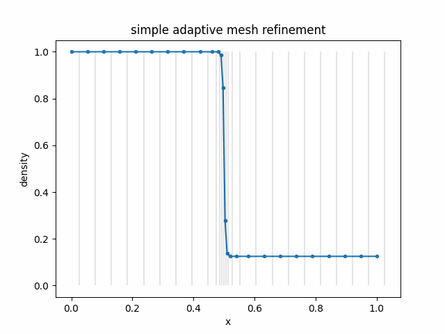

# jamr
This is (currently) a small experimental project on
dynamic adaptive mesh refinement (AMR) (here
used synonymously with adaptive multiresolution)
in JAX. At some point to be brought into 
[jf1uids](https://github.com/leo1200/jf1uids) as an option.

## Computational Approach - Is AMR worth it?
If we want jit-compilability, array sizes must be
statically known. We use a preallocated buffer
and essentially carry out all operations on the full
buffer (embracing array-oriented programming with
wasted computation, see
[here](https://github.com/jax-ml/jax/discussions/19178)
for a discussion).

This approach will be especially fruitful in a simulation
where we need to resolve some (small) regions with high accuracy
and the demand for high accuracy (across the whole computational
domain) does not vary too much over time. In this case we can
choose a buffer size such that the overhead of the full buffer computation is amortized,
compared to a high-resolution fixed-grid simulation.

## On Neighborhood Information
For the different fluid computations, we need information 
from neighboring cells. 

- In a sorted 1D array, neighborhood information is trivial.
- In higher dimensions, Space Filling Curves give us a linear ordering
  of the cells. To query neighbors by e.g. their Morton index, hash maps
  can be useful (O(1) complexity) but then we would need dynamic hash 
  maps - which is difficult (see [here](https://github.com/jax-ml/jax/discussions/10475)
  for a discussion).
- If we have an ordered list (or a tree structure) of the cells, we can
  perform binary search to find cells by the Morton index (O(log(n)) complexity).

With this in mind our current design choice is an ordered list, where we 
have to accept some memory management overhead.

## State of the Project

- [x] simple 1D fluid simulations with refinement, fully jit-compiled ✅
- [ ] derefinement
- [ ] 2D simulations
- [ ] tests on performance
- [ ] tests on differentiability

## Alternatives to AMR

- automatically adaptive particle-based methods, like SPH, see e.g. [jax-sph](https://github.com/tumaer/jax-sph)